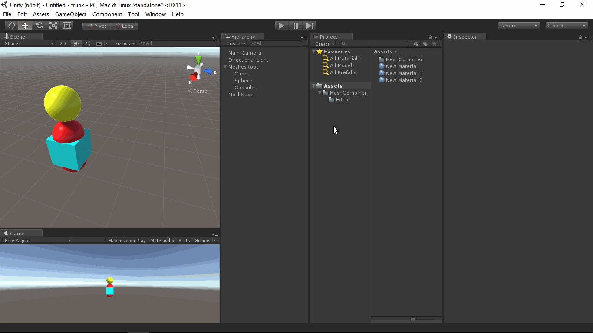

# MeshCombiner
- [中文手册](./README_ZH.md)

## Summary
- Unity Meshes combiner.

## Demand
- In Unity scene, a large number of static models(example stones) spend lots of computer resource and
  hard to manage them in Unity Hierarchy. therefore, we hope that we can combine them to a model(Mesh).

## Environment
- Unity 5.0 or above.
- .Net Framework 3.0 or above.

## Achieve
- MeshCombiner：Draw the extend editor window and combine Meshes.

## Preview
- MeshCombiner

## Contact
- If you have any questions, feel free to contact me at mogoson@qq.com.